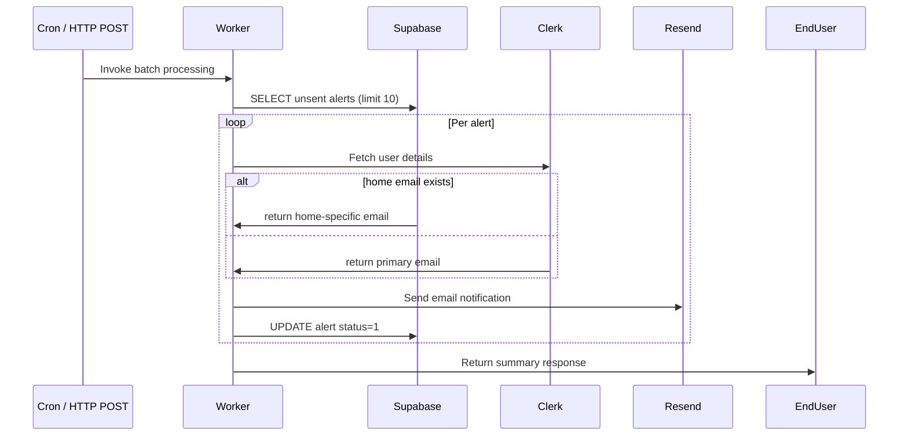

# Notification Worker

## Overview

A Cloudflare Worker that processes smart home alerts from a Supabase PostgreSQL database, enriches user information via Clerk, and sends email notifications via Resend.

Features:

- Batch processing: fetch up to 10 unsent alerts per invocation.
- User lookup: Clerk SDK retrieves user first name and primary email.
- Home-specific override: `user_homes.email` takes precedence over Clerk email when set.
- Email notifications: use Resend API to deliver messages.
- Status updates: mark alerts as sent in Supabase.
- Triggers:
  - HTTP POST endpoint `/` for manual batch execution.
  - Cron-based `scheduled` handler for automated runs.

## Tech Stack


| Component         | Purpose                                   |
| ----------------- | ----------------------------------------- |
| Cloudflare Worker | Serverless runtime for notification logic |
| Supabase          | PostgreSQL database for alert storage     |
| Clerk             | User identity lookup and email retrieval  |
| Resend            | Transactional email delivery service      |
| Bun               | Local development and testing runtime     |

## Workflow



## Environment Variables

Set these as **secrets** in Cloudflare (do not commit to source):

| Variable           | Required | Description                                    |
| ------------------ | -------- | ---------------------------------------------- |
| `SUPABASE_URL`     | Yes      | `https://<project-ref>.supabase.co`            |
| `SUPABASE_KEY`     | Yes      | Supabase service role key (server-side access) |
| `CLERK_SECRET_KEY` | Yes      | Clerk backend SDK secret                       |
| `RESEND_API_KEY`   | Yes      | Resend API key for email sending               |

### Local Development

Create a `.dev.vars` file in the project root (add to `.gitignore`):

```bash
SUPABASE_URL="https://<project-ref>.supabase.co"
SUPABASE_KEY="<your-service-role-key>"
CLERK_SECRET_KEY="<your-clerk-secret-key>"
RESEND_API_KEY="<your-resend-api-key>"
```

Then run:

```bash
bun run dev
```

### Deployment

Use Wrangler to configure secrets and deploy:

```bash
wrangler secret put SUPABASE_URL
wrangler secret put SUPABASE_KEY
wrangler secret put CLERK_SECRET_KEY
wrangler secret put RESEND_API_KEY
bun run deploy
```

## Database Schema

### `user_homes` Table

| Column       | Type      | Description                              |
| ------------ | --------- | ---------------------------------------- |
| `home_id`    | TEXT      | Smart home group identifier              |
| `user_id`    | TEXT      | External user system ID (Clerk user)     |
| `email`      | TEXT      | Override notification email for the home |
| `created_at` | TIMESTAMP | Relationship creation timestamp          |

### `alert_log` Table

| Column        | Type      | Description                          |
| ------------- | --------- | ------------------------------------ |
| `id`          | BIGINT PK | Primary key                          |
| `home_id`     | TEXT      | Smart home group identifier          |
| `user_id`     | TEXT      | External user system ID              |
| `message`     | TEXT      | Alert message content                |
| `sent_status` | INT       | `0` = unsent, `1` = sent             |
| `created_at`  | TIMESTAMP | Timestamp when the alert was created |

## License

[MIT](LICENSE)
