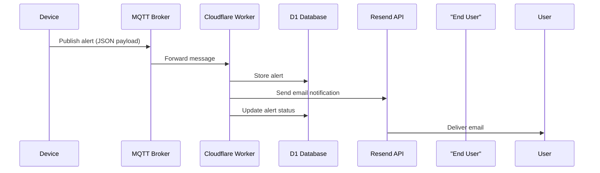

# Notification Worker

## Overall

Cloudflare Worker that handles smart home notifications through:

- Real-time MQTT message processing
- Email alerts via Resend API
- State tracking in D1 SQL database
- HTTP API for manual alerts

## Tech Stack


| Component         | Purpose                        |
| ----------------- | ------------------------------ |
| Cloudflare Worker | Serverless runtime environment |
| D1 Database       | Persistent storage for alerts  |
| MQTT              | Real-time message broker       |
| Resend            | Transactional email service    |
| Bun               | Development/test runtime       |

## Workflow



## Environment Variables

Set these in `wrangler.toml` or Cloudflare dashboard:

| Variable         | Required | Description                    |
| ---------------- | -------- | ------------------------------ |
| `MQTT_USERNAME`  | Yes      | MQTT broker authentication     |
| `MQTT_PASSWORD`  | Yes      | MQTT broker authentication     |
| `RESEND_API_KEY` | Yes      | Email sending API key          |
| `DB` (binding)   | Yes      | D1 database connection binding |

**Configuration Example:**

```toml
# wrangler.toml
[vars]
MQTT_USERNAME = "your-broker-username"
MQTT_PASSWORD = "your-broker-password"
RESEND_API_KEY = "re_123456789"

[[d1_databases]]
binding = "DB"
database_name = "notification-db"
database_id = "YOUR_DATABASE_ID"
```

## Usage

```bash
# Local development
bun run dev

# Production deployment
bun run deploy
```

> **Warning**  
> Never commit secrets to version control - use Wrangler's secret management

## Database Schema

#### `user_homes` Table

Manages user-home relationships for notification targeting:

| Column     | Type     | Description                                |
| ---------- | -------- | ------------------------------------------ |
| user_id    | TEXT     | External user system ID (e.g., from Auth0) |
| home_id    | TEXT     | Smart home group identifier                |
| email      | TEXT     | Notification email address                 |
| created_at | DATETIME | Relationship creation timestamp            |

#### `alert_log` Table

Tracks security alerts and their resolution status:

| Column      | Type     | Description                           |
| ----------- | -------- | ------------------------------------- |
| device_id   | TEXT     | Reference to triggering device        |
| alert_type  | TEXT     | 'motion'/'contact'/'temperature'      |
| status      | TEXT     | 'triggered'/'acknowledged'/'resolved' |
| resolved_at | DATETIME | Null until alert is resolved          |
| created_at  | DATETIME | Alert creation timestamp              |

## Development

The worker uses:

- Cloudflare Workers for serverless execution
- D1 for database operations (SQLite-compatible)
- Bun for local development and testing
